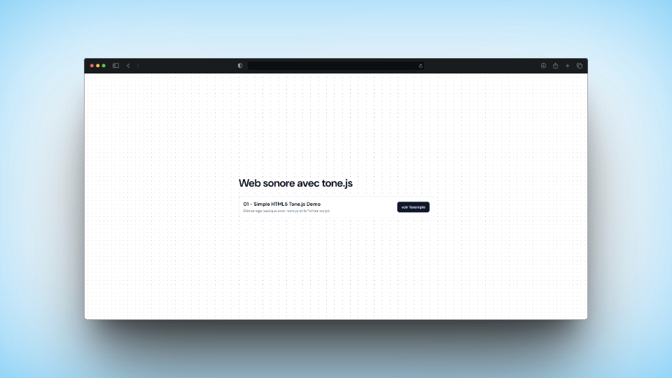

# Expérimentations sonores avec tone.js

Le but de ce repository est de tester des idées sonores et interactives dans des pages Web avec [l'audio framework](https://tonejs.github.io/)

## contributeur·rice

- [@nicolastilly](https://github.com/nicolastilly)
